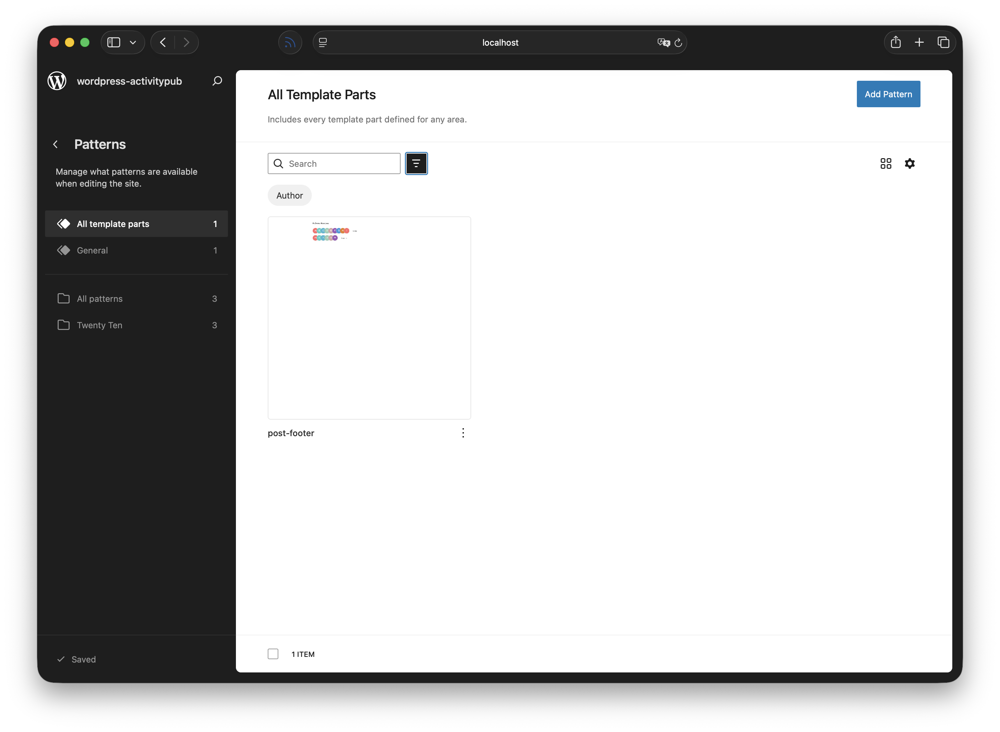
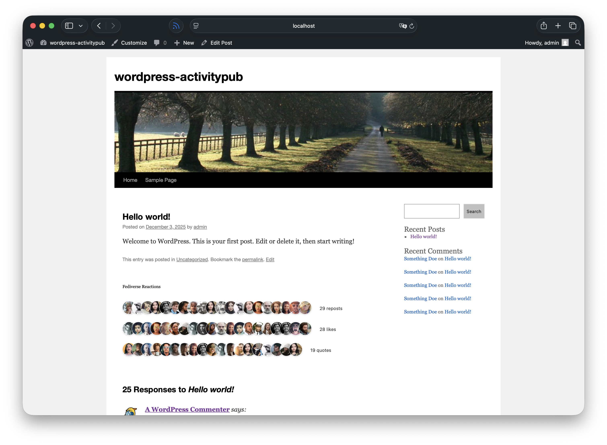
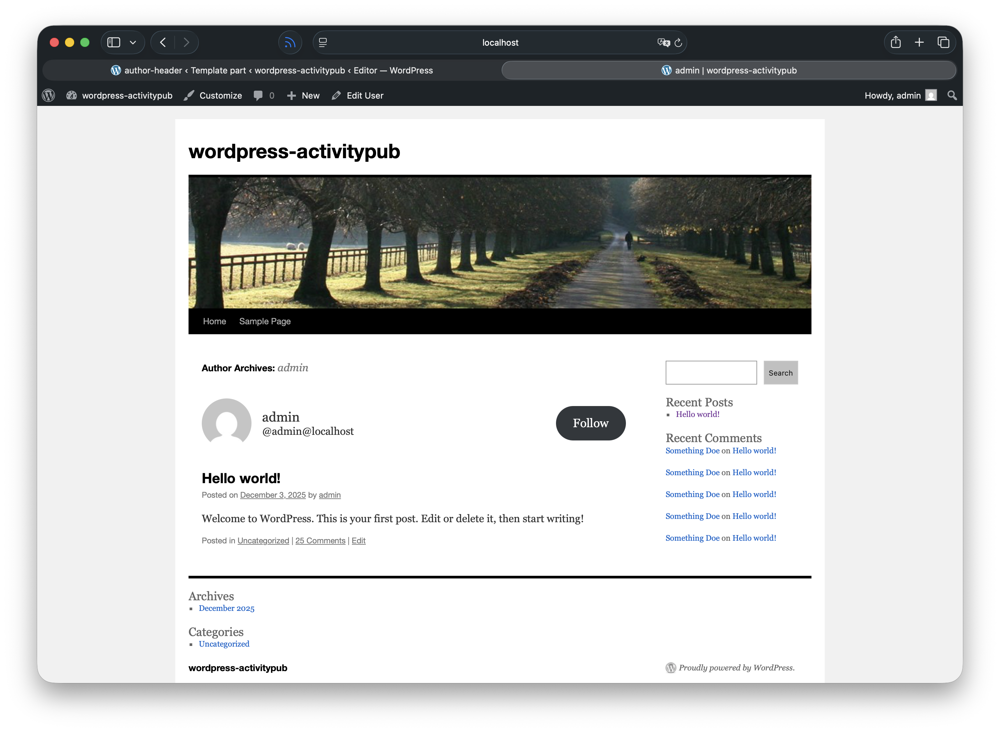

# Using ActivityPub Blocks in Classic Themes

If you're using a classic (non-block) theme, you can still take advantage of the ActivityPub plugin's blocks by using Block Template Parts. This allows you to add features like reactions (likes and boosts) and follow buttons to your classic theme without switching to a block theme.

## What are Block Template Parts?

Block Template Parts allow you to use the block editor to create reusable template sections that can be embedded in classic themes. This gives you the flexibility of blocks while maintaining your classic theme.

For a comprehensive guide on Block Template Parts, see the [WordPress Learn tutorial on Using Block Template Parts in Classic Themes](https://learn.wordpress.org/tutorial/using-block-template-parts-in-classic-themes/).

## Enabling Block Template Parts in Your Theme

Before you can create and use block template parts, your classic theme needs to declare support for this feature.

Add the following code to your theme's `functions.php` file:

```php
add_action( 'after_setup_theme', 'my_theme_setup' );

function my_theme_setup() {
    add_theme_support( 'block-template-parts' );
}
```

After adding this code, you'll see a **Template Parts** option in your WordPress admin under **Appearance**. This is where you'll create the template parts that contain your ActivityPub blocks.

## How to Use Block Template Parts

To use a block template part in your classic theme, use the `block_template_part()` function:

```php
<?php block_template_part( 'template-part-name' ); ?>
```

## Example 1: Adding Reactions to Single Posts

The ActivityPub Reactions block displays likes and boosts (shares) that your posts have received from the fediverse. Here's how to add it to your single post pages.

### Step 1: Create a Block Template Part

Create a directory called `parts` in your theme directory if it doesn't already exist. Then create a new file called `post-footer.html` in the `parts` directory:

```html
<!-- wp:activitypub/reactions /-->
```

Once you've created the file, WordPress will automatically detect it. You can then edit it in the Site Editor under **Appearance > Editor > Template Parts** to customize the block settings or add additional content.



### Step 2: Add to Your Theme

Open your theme's `single.php` file (or whichever template file displays your single posts) and add the following code where you want the post footer to appear (typically after the post content):

```php
<?php
if ( is_singular( 'post' ) && function_exists( 'block_template_part' ) ) {
    block_template_part( 'post-footer' );
}
?>
```

**Suggested placement locations:**
- After `the_content()` in your post loop
- Before or after the comments section
- In a dedicated post meta section



### Example: Full Implementation in single.php

```php
<article id="post-<?php the_ID(); ?>" <?php post_class(); ?>>
    <header class="entry-header">
        <?php the_title( '<h1 class="entry-title">', '</h1>' ); ?>
    </header>

    <div class="entry-content">
        <?php the_content(); ?>
    </div>

    <?php
    if ( function_exists( 'block_template_part' ) ) {
        block_template_part( 'post-footer' );
    }
    ?>
</article>
```

## Example 2: Adding Follow Button for Authors

The ActivityPub Follow block allows visitors to follow authors directly from your site. This is useful on author archive pages or as author information within posts.

### Option A: On Author Archive Pages

#### Step 1: Create a Block Template Part

Create a file called `author-header.html` in your theme's `parts` directory:

```html
<!-- wp:activitypub/follow /-->
```

After creating the file, you can customize it in **Appearance > Editor > Template Parts** if needed.



#### Step 2: Add to author.php

Open your theme's `author.php` file and add the author header in the author bio section:

```php
<div class="author-info">
    <?php
    if ( function_exists( 'block_template_part' ) ) {
        block_template_part( 'author-header' );
    }
    ?>
</div>
```

### Option B: As Author Information in Posts

You can also display the follow button as part of the author bio box that appears on individual posts.

#### Step 1: Create the Template Part

Create a file called `post-meta.html` in your theme's `parts` directory:

```html
<!-- wp:activitypub/follow /-->
```

#### Step 2: Add to single.php

Add the post meta box after your post content:

```php
<article id="post-<?php the_ID(); ?>" <?php post_class(); ?>>
    <div class="entry-content">
        <?php the_content(); ?>
    </div>

    <?php
    if ( function_exists( 'block_template_part' ) ) {
        block_template_part( 'post-meta' );
    }
    ?>
</article>

<?php comments_template(); ?>

## Additional Tips

### Conditional Display

You can control when template parts are displayed using WordPress conditional tags:

```php
<?php
// Only on single posts
if ( is_singular( 'post' ) && function_exists( 'block_template_part' ) ) {
    block_template_part( 'post-footer' );
}

// Only on author archives
if ( is_author() && function_exists( 'block_template_part' ) ) {
    block_template_part( 'author-header' );
}

// On both single posts and pages
if ( is_singular( array( 'post', 'page' ) ) && function_exists( 'block_template_part' ) ) {
    block_template_part( 'post-meta' );
}
?>
```

## Available ActivityPub Blocks

The ActivityPub plugin provides several blocks you can use in your template parts:

- **Reactions**: Display likes and boosts from the fediverse
- **Follow**: Allow visitors to follow authors
- **Followers**: Display a list of followers
- **Profile**: Display author profile information for the fediverse

## Troubleshooting

### Template Part Not Showing

If your template part isn't displaying:

1. Make sure you've created and saved the template part in the Site Editor
2. Verify the name matches exactly (case-sensitive)
3. Check that `block_template_part()` function exists (WordPress 6.3+)
4. Ensure the ActivityPub plugin is activated

### Styling Issues

If the blocks don't match your theme's styling:

1. Add custom CSS to your theme's stylesheet
2. Use the block editor's design tools to adjust spacing, colors, and typography
3. Check your theme's CSS specificity - you may need to use more specific selectors

## Further Resources

- [WordPress Learn: Using Block Template Parts in Classic Themes](https://learn.wordpress.org/tutorial/using-block-template-parts-in-classic-themes/)
- [ActivityPub Plugin Documentation](https://github.com/Automattic/wordpress-activitypub)
- [WordPress Block Editor Handbook](https://developer.wordpress.org/block-editor/)

## Need Help?

If you need assistance implementing these blocks in your classic theme, visit the [ActivityPub plugin support forum](https://wordpress.org/support/plugin/activitypub/) on WordPress.org.
